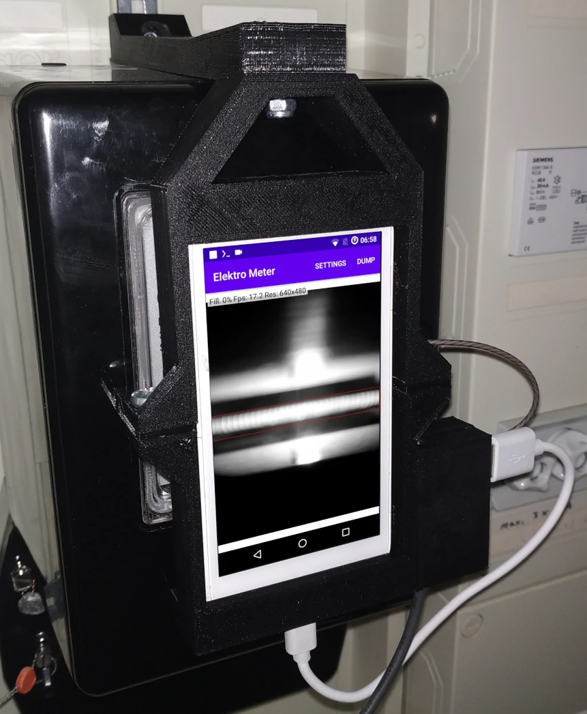
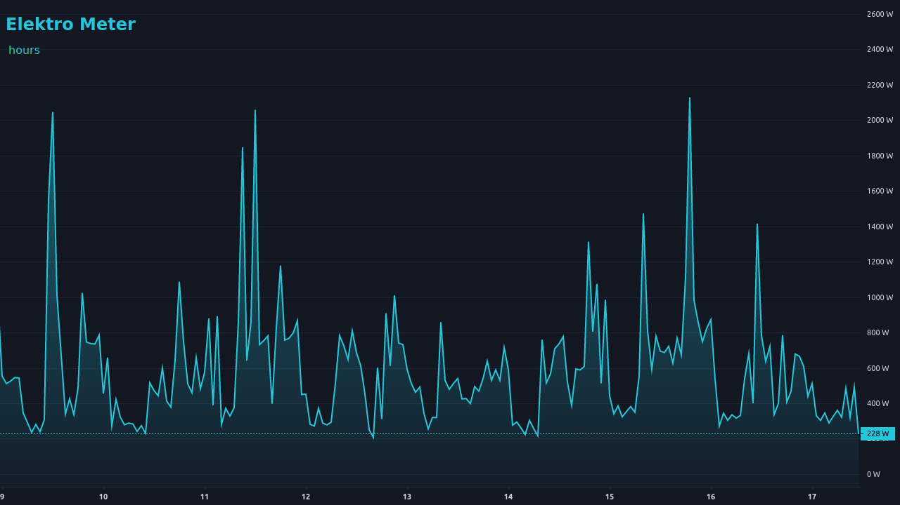

# Elektro Meter

Elektro Meter is a logger for analog electricity meters using an (old)
Android phone.
It uses the phone's camera to detect the marker on the rotor disk.
When the marker is detected, it logs the timestamp to a text file on the
internal storage.

A simple website is provided to analyze the data.





## Installation

You need an (old) Android phone and mount it in front of the meter.

Install the APK *app/build/outputs/apk/release/app-release.apk* on Android and
open the App.

Press the **Settings** button and choose settings that provide good detection
of the maker.

To simplify the process of finding the right settings wait until the marker
comes into view and press the **Dump** button. It creates the file
**ElektroMeter.dump** in the internal storage.

Copy the file to your computer and run `./dump-inspector.py /path/to/ElektroMeter.dump`.
It creates a series of images that can be used to quickly determine good parameters.
Run `./dump-inspector.py --help` to see the arguments for changing the default parameters
(e.g. run `./dump-inspector.py /path/to/ElektroMeter.dump --rotation 90 --luma 10`
and check the generated images again).

### Web server

The website for accessing and analyzing the data can be hosted directly on the
phone using **Termux**.

Install [**Termux**](https://f-droid.org/de/packages/com.termux/) and
[**Termux:Boot**](https://f-droid.org/de/packages/com.termux.boot/).

Start the app **Termux:Boot** at least once for it to work.

In **Termux** first do an update.

```sh
pkg update
```

Allow access to the internal storage.

```sh
termux-setup-storage
```

Install the webserver.

```sh
pkg install nginx
```

Edit the file *~/../usr/etc/nginx/nginx.conf* and add/replace the following
in the **server** section:

```nginx
location / {
    root   /data/data/com.termux/files/home/html;
    index  index.html index.htm;
}

location = /ElektroMeter.log {
    root   /data/data/com.termux/files/home/storage/shared;
}
```

Open the file *website/index.html* with a text editor and set the
meter constant.

``` javascript
// ===== Settings =====
const cz = 1; // Meter constant
// === End Settings ===
```

You can find the value written on your electricity meter.

Copy the file *website/index.html* to your phone and place it in the folder *~/html/*.
Additionally you need to download
[**lightweight-charts.standalone.production.js**](https://unpkg.com/lightweight-charts@3.3.0/dist/lightweight-charts.standalone.production.js)
and put it in the folder too.

To start the webserver on boot create the file *~/.termux/boot/start-nginx*:

```sh
#!/data/data/com.termux/files/usr/bin/sh
termux-wake-lock
nginx -g "daemon off;"
```

Finally start the webserver (without rebooting).

```sh
chmod +x ~/.termux/boot/start-nginx
~/.termux/boot/start-nginx
```

## Building

Run `./gradlew assembleRelease`. It creates the signed
(using *app/DummyKeystore.jks*) APK at
*app/build/outputs/apk/release/app-release.apk*.
